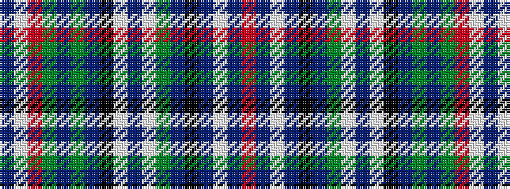

BWRGBGBKWBWGBKBWBR

It is a 18 stripe tartan.

<figure class="pat-woven">

<figcaption>idealised sample</figcaption>
</figure>

## Colour Sequence



## Tartans with this colour sequence

| Tartans |
|---------------|
| [Couper of Gogar](/variants/s18/db2lp4r2g24db4g2db4k10lp4db2lp4g8db1k1db22lp4db2r2~x2/)|
||
