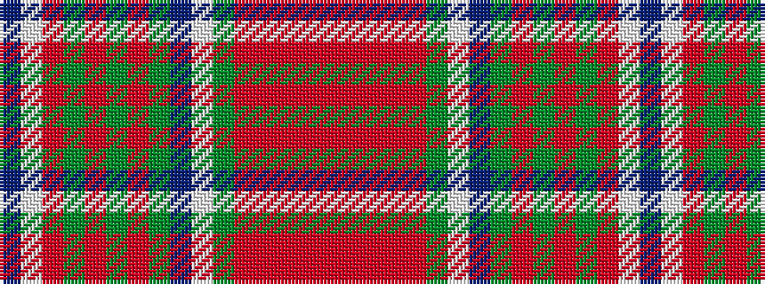

BWRGRGRGBWGRRRRR

It is a 16 stripe tartan.

<figure class="pat-woven">

<figcaption>idealised sample</figcaption>
</figure>

## Colour Sequence



## Tartans with this colour sequence

| Tartans |
|---------------|
| [Keilar (2013)](/setts/s16/o15r3o3r1o35dg5w2db2dg35r1dg3r3dg15o5w2db2~x2/)|
||
