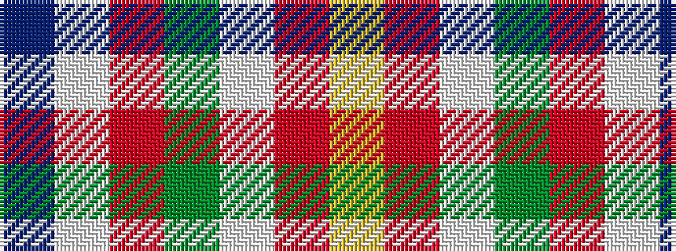

BWRGWRY

It is a 7 stripe tartan.

<figure class="pat-woven">

<figcaption>idealised sample</figcaption>
</figure>

## Colour Sequence



## Tartans with this colour sequence

| Tartans |
|---------------|
| [Iberia Dress, Blue (Fashion)](/variants/s7/db60w2r10dg6w4r15ly10~x2/)|
||
