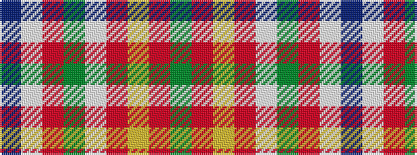

BWRGWRYRG

It is a 9 stripe tartan.

<figure class="pat-woven">

<figcaption>idealised sample</figcaption>
</figure>

## Colour Sequence



## Tartans with this colour sequence

| Tartans |
|---------------|
| [Scotts Valley](/setts/s9/dg20r1ly1r1lb1dg1r1lb1db5~x4/)|
||
