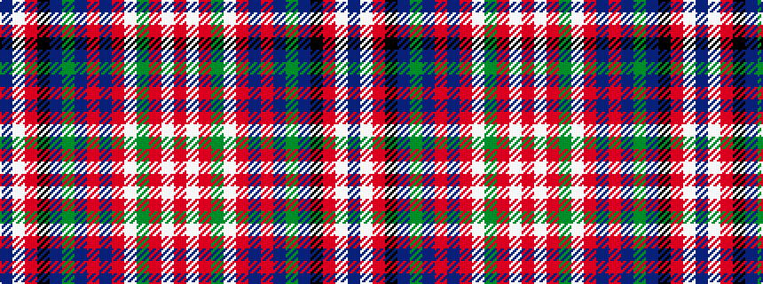

BWRKBGBRBRWGRWR

It is a 15 stripe tartan.

<figure class="pat-woven">

<figcaption>idealised sample</figcaption>
</figure>

## Colour Sequence



## Tartans with this colour sequence

| Tartans |
|---------------|
| [MacFarlane Dress](/variants/s15/db4w2r6k1db12dg4db2r6db1r6w2dg8r2w16r4~x2/)|
||
