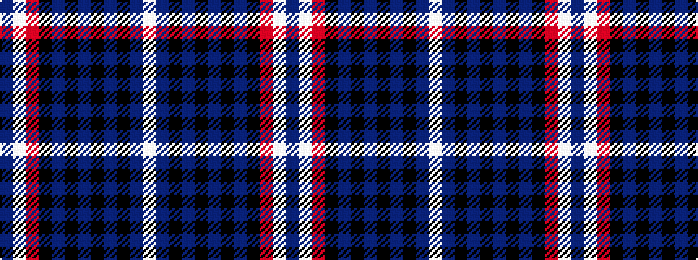

BWRKBKBKBKBW

It is a 12 stripe tartan.

<figure class="pat-woven">

<figcaption>idealised sample</figcaption>
</figure>

## Colour Sequence



## Tartans with this colour sequence

| Tartans |
|---------------|
| [Norwegian Centennial](/variants/s12/w24t50k2t8k4t2k4t8k2r40w5t10/)|
||
