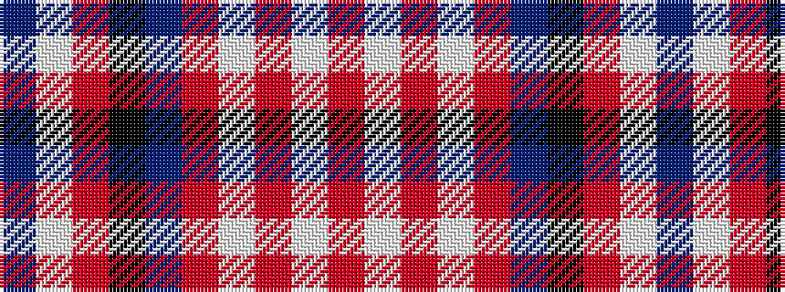

BWRKBRWRWR

It is a 10 stripe tartan.

<figure class="pat-woven">

<figcaption>idealised sample</figcaption>
</figure>

## Colour Sequence



## Tartans with this colour sequence

| Tartans |
|---------------|
| [City of Pointe-Claire](/setts/s10/b4w1o1k2b4o2w1o1w1o1~x4/)|
||
