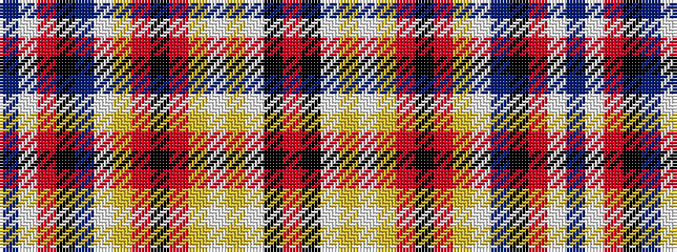

BWRKBWYRKRYWYWKR

It is a 16 stripe tartan.

<figure class="pat-woven">

<figcaption>idealised sample</figcaption>
</figure>

## Colour Sequence



## Tartans with this colour sequence

| Tartans |
|---------------|
| [MacGlashan #3](/setts/s16/r20k3w2lo25w2ly5r4k2r4ly5w3t4k5r6w1t1~x2/)|
||
