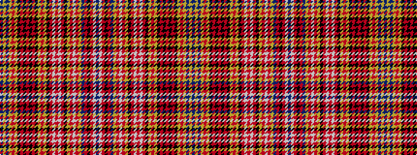

BWRKRBYRWRYKRWRWRKYRYKRKRKRKYRYBYB

It is a 34 stripe tartan.

<figure class="pat-woven">

<figcaption>idealised sample</figcaption>
</figure>

## Colour Sequence



## Tartans with this colour sequence

| Tartans |
|---------------|
| [Ogilvie](/variants/s34/db3lb2r12k2r2db2lo2o6lb2o6lo2k3r6lb2r6lb2r6k3lo4o6lo4k2r2k2r2k2r2k2lo2o6lo2db2lo2db2~x2/)|
||
