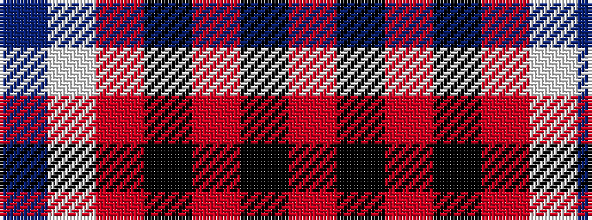

BWRKRKR

It is a 7 stripe tartan.

<figure class="pat-woven">

<figcaption>idealised sample</figcaption>
</figure>

## Colour Sequence



## Tartans with this colour sequence

| Tartans |
|---------------|
| [Leiato of American Samoa (Personal)](/variants/s7/o45k5o28k5r5w2do6~x2/)|
||
