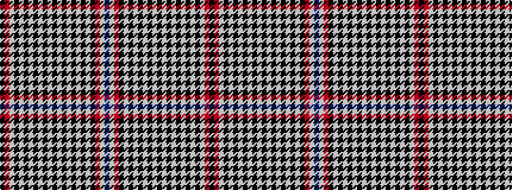

BWRKWKWKWKWKWKWKWKWKWRK

It is a 23 stripe tartan.

<figure class="pat-woven">

<figcaption>idealised sample</figcaption>
</figure>

## Colour Sequence



## Tartans with this colour sequence

| Tartans |
|---------------|
| [McCready (Name)](/variants/s23/db24w1r3k4w1k1w1k1w1k1w1k1w1k1w1k1w1k1w1k1w1r27k2~x2/)|
||
