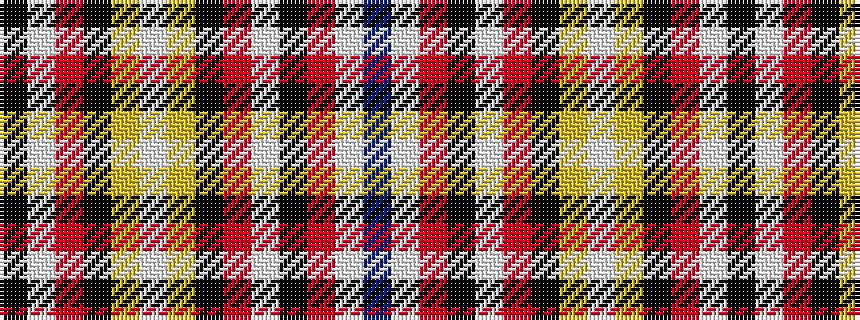

BWRKWRKYWYKRWK

It is a 14 stripe tartan.

<figure class="pat-woven">

<figcaption>idealised sample</figcaption>
</figure>

## Colour Sequence



## Tartans with this colour sequence

| Tartans |
|---------------|
| [Manac](/setts/s14/k33w1r23k1lr6w1lr6k1r23w1k33r3w3b3~x2/)|
||
