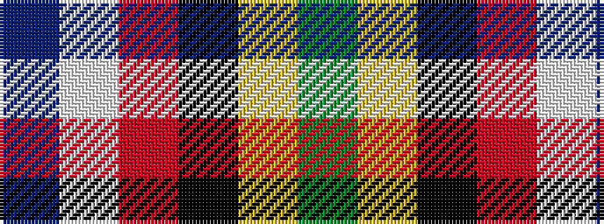

BWRKYG

It is a 6 stripe tartan.

<figure class="pat-woven">

<figcaption>idealised sample</figcaption>
</figure>

## Colour Sequence



## Tartans with this colour sequence

| Tartans |
|---------------|
| [Crookstoun (Personal)](/setts/s6/b53w27r5k19lo1g11~x2/)|
||
| [Crookstoun, James (West Lothian) (Personal)](/setts/s6/t53w27r5k19lo1dg11~x2/)|
||
