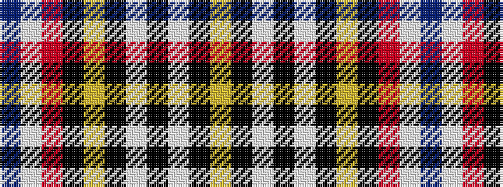

BWRKYKWKWKY

It is a 11 stripe tartan.

<figure class="pat-woven">

<figcaption>idealised sample</figcaption>
</figure>

## Colour Sequence



## Tartans with this colour sequence

| Tartans |
|---------------|
| [Norwegian Night](/setts/s11/db6w3r14k3lo2k2w2k38w2k2lo2~x2/)|
||
