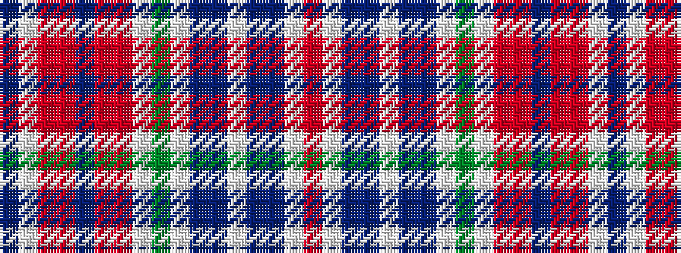

BWRRBRRWGWBBWBBWR

It is a 17 stripe tartan.

<figure class="pat-woven">

<figcaption>idealised sample</figcaption>
</figure>

## Colour Sequence



## Tartans with this colour sequence

| Tartans |
|---------------|
| [Birral (Clan)](/variants/s17/r65w2dp8t4w2t4dp8w2g32w2r8ri4dp2ri4r8w2dp16~x2/)|
||
| [Birral, Burrell](/variants/s17/ri65w2p8t4w2t4p8w2g32w2ri8r4p2r4ri8w2p16~x2/)|
||
