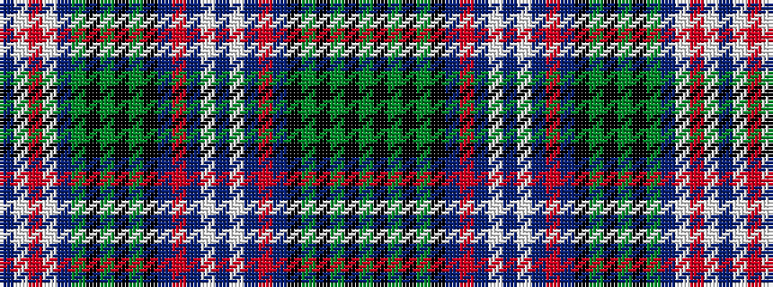

BWRWBGKGKGKBRBWBWBRBKGKGKG

It is a 26 stripe tartan.

<figure class="pat-woven">

<figcaption>idealised sample</figcaption>
</figure>

## Colour Sequence



## Tartans with this colour sequence

| Tartans |
|---------------|
| [Scottish National Dress District Tartan](/variants/s26/db12w11r2w11db12dg11k2dg3k2dg11k8db2r2db2w2db11w2db2r2db2k8dg11k2dg3k2dg11~x2/)|
||
