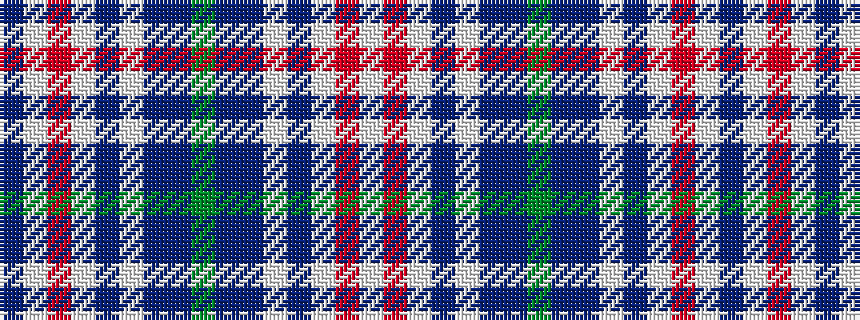

BWRWBWBBGBBWBWRW

It is a 16 stripe tartan.

<figure class="pat-woven">

<figcaption>idealised sample</figcaption>
</figure>

## Colour Sequence



## Tartans with this colour sequence

| Tartans |
|---------------|
| [Heather (RSPCC)](/setts/s16/db4lb3o30lb3dp16lb3dp10dpi48g4~x2/)|
||
