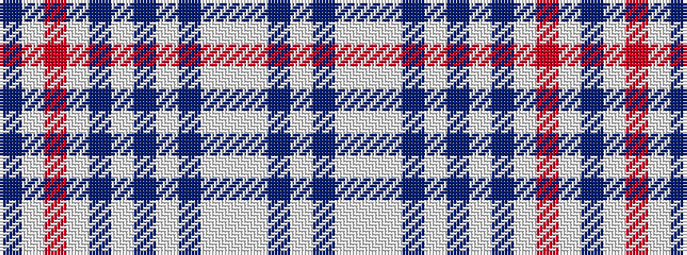

BWRWBWBWBWWWBW

It is a 14 stripe tartan.

<figure class="pat-woven">

<figcaption>idealised sample</figcaption>
</figure>

## Colour Sequence



## Tartans with this colour sequence

| Tartans |
|---------------|
| [Barra, Fuschia (Dance)](/setts/s14/p6w6r3w30p20lt6dp1w8dp1lt4w2lt7dp1w6~x2/)|
||
