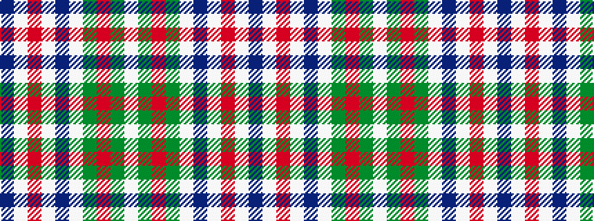

BWRWBWGRGW

It is a 10 stripe tartan.

<figure class="pat-woven">

<figcaption>idealised sample</figcaption>
</figure>

## Colour Sequence



## Tartans with this colour sequence

| Tartans |
|---------------|
| [Liama, The](/variants/s10/do2lb20r2lb2do3lb3y3r8y26lb2~x2/)|
||
