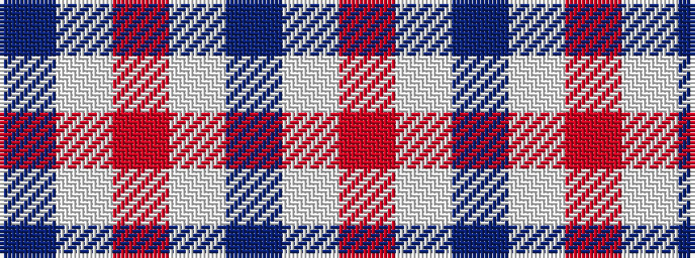

BWRWBWR

It is a 7 stripe tartan.

<figure class="pat-woven">

<figcaption>idealised sample</figcaption>
</figure>

## Colour Sequence



## Tartans with this colour sequence

| Tartans |
|---------------|
| [Washington State University Cougar](/setts/s7/r6w3n6lb10r38w2n4/)|
||
