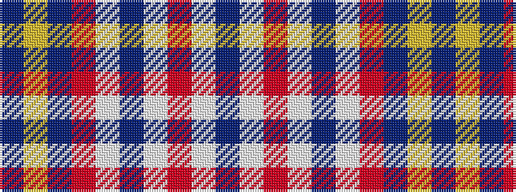

BWRWBWRBYB

It is a 10 stripe tartan.

<figure class="pat-woven">

<figcaption>idealised sample</figcaption>
</figure>

## Colour Sequence



## Tartans with this colour sequence

| Tartans |
|---------------|
| [Gray, Thomas (Personal)](/setts/s10/n1w1o2w1n1w16o6db1ly1t1~x4/)|
||
