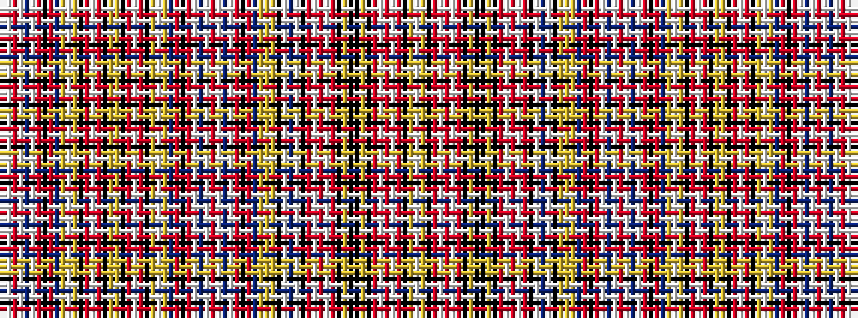

BWRWBWRKRBYWYKRWRKYYKRWRKYWYBRKRWBWRWBWRKRBYYYKWBWKRWRWRKYKKYKRWRWRKYW

It is a 70 stripe tartan.

<figure class="pat-woven">

<figcaption>idealised sample</figcaption>
</figure>

## Colour Sequence



## Tartans with this colour sequence

| Tartans |
|---------------|
| [Ogilvie of Strathallan](/setts/s70/w3ly3k3r5w3r5w3r5k3ly3k3k3ly3k3r5w3r5w3r5k13w1db3w1k13ly8ly3ly8db3r3k3r13w1db1w1r13w1db1w1r13k3r3db3ly3w3ly3k5r5w3r5k3ly8ly8k3r5w3r5k5ly3w3ly3db3r3k3r13w1db1w1r13w1db1~x2/)|
||
