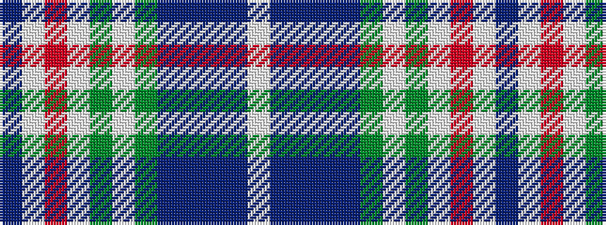

BWRWGWGBBBBW

It is a 12 stripe tartan.

<figure class="pat-woven">

<figcaption>idealised sample</figcaption>
</figure>

## Colour Sequence



## Tartans with this colour sequence

| Tartans |
|---------------|
| [Summerwood (School)](/setts/s12/db76w3r4w3g4w3dg8db19t20db3t8w10/)|
||
