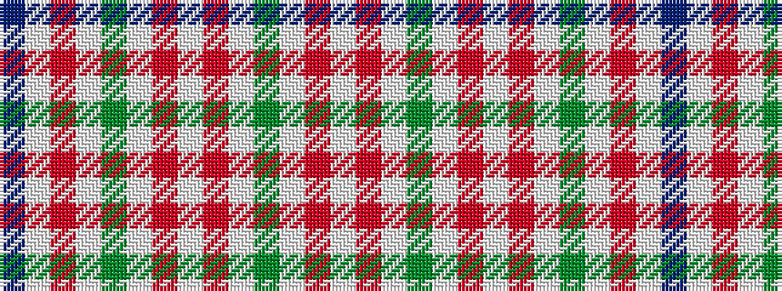

BWRWGWRWRWGWRW

It is a 14 stripe tartan.

<figure class="pat-woven">

<figcaption>idealised sample</figcaption>
</figure>

## Colour Sequence



## Tartans with this colour sequence

| Tartans |
|---------------|
| [Milne Green (Dance)](/setts/s14/w5r2w12g17w12r2w12r2w12g17w12r2w5p2~x4/)|
||
