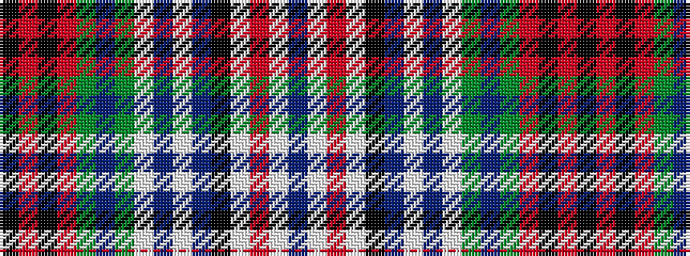

BWRWKBWBWGBGRKRK

It is a 16 stripe tartan.

<figure class="pat-woven">

<figcaption>idealised sample</figcaption>
</figure>

## Colour Sequence



## Tartans with this colour sequence

| Tartans |
|---------------|
| [Gordon Red.. Family Tartan Tartan Number: 652. Earliest known date: pre 1819 Sample from the Telfer-Dunbar collection. Also known as 'Old Huntly' and frequently used as the Huntly District tartan. Not to be confused with the 'usual' Huntly District tartan which is based on the MacRae, Ross, Grant group with which it does not appear to be related. See products available Copyright © Blair Urquhart, Comrie, 2015](/setts/s16/dp16w2r7w2k14t6w2dp15w2g17t6g6r8k6r8k2~x2/)|
||
| [Gordon, Red](/setts/s16/p16w2r7w2k14t6w2p15w2g17t6g6r8k6r8k2~x2/)|
||
| [Gordon, Red (Clan/District)](/setts/s16/dp16w2r7w2k14t6w2dp15w2dg17t6dg6r8k6r8k2~x2/)|
||
