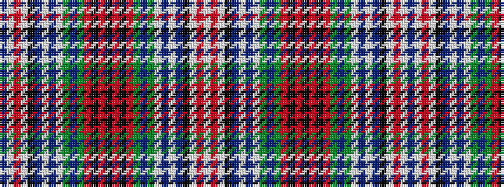

BWRWKBWBWGBGRKRKRKRGBGWBWBKWRW

It is a 30 stripe tartan.

<figure class="pat-woven">

<figcaption>idealised sample</figcaption>
</figure>

## Colour Sequence



## Tartans with this colour sequence

| Tartans |
|---------------|
| [Gordon, Red (1819)](/setts/s30/dp16w2ri7w2k14t6w2dp15w2dg17t6dg6r8k6r8k2~x2/)|
||
