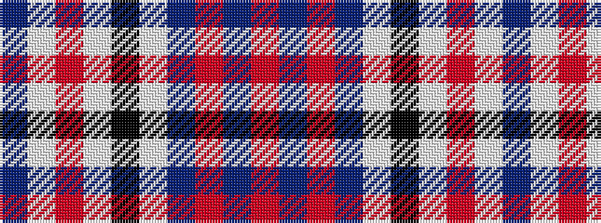

BWRWKWBRBR

It is a 10 stripe tartan.

<figure class="pat-woven">

<figcaption>idealised sample</figcaption>
</figure>

## Colour Sequence



## Tartans with this colour sequence

| Tartans |
|---------------|
| [Commonwealth Games 1986](/setts/s10/db6w2r6w3k2w6db10r2db3r2~x4/)|
||
| [Commonwealth, Games 1986](/setts/s10/db12w4r12w5k4w12db20r4db5r4~x2/)|
||
