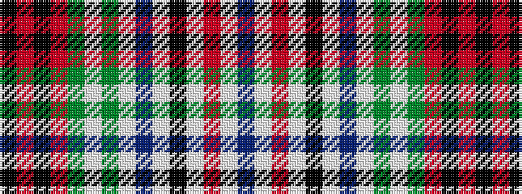

BWRWKWBWGWGRKRK

It is a 15 stripe tartan.

<figure class="pat-woven">

<figcaption>idealised sample</figcaption>
</figure>

## Colour Sequence



## Tartans with this colour sequence

| Tartans |
|---------------|
| [Huntly Old](/setts/s15/dp16lb2r7lb2k14lb8dp15lb2dg17lb6dg6r8k6r8k2/)|
||
