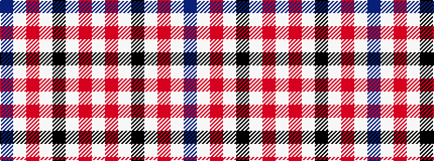

BWRWKWRW

It is a 8 stripe tartan.

<figure class="pat-woven">

<figcaption>idealised sample</figcaption>
</figure>

## Colour Sequence



## Tartans with this colour sequence

| Tartans |
|---------------|
| [Boswell Dress Personal Tartan](/variants/s8/w13r3w2k5w2r3w13db8~x2/)|
||
