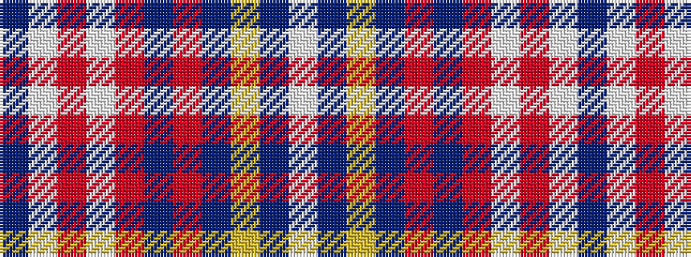

BWRWRBRBYBW

It is a 11 stripe tartan.

<figure class="pat-woven">

<figcaption>idealised sample</figcaption>
</figure>

## Colour Sequence



## Tartans with this colour sequence

| Tartans |
|---------------|
| [Good Morning America (Corporate)](/setts/s11/db2w2r2w2r2db2r2db12ly1db2w2~x4/)|
||
