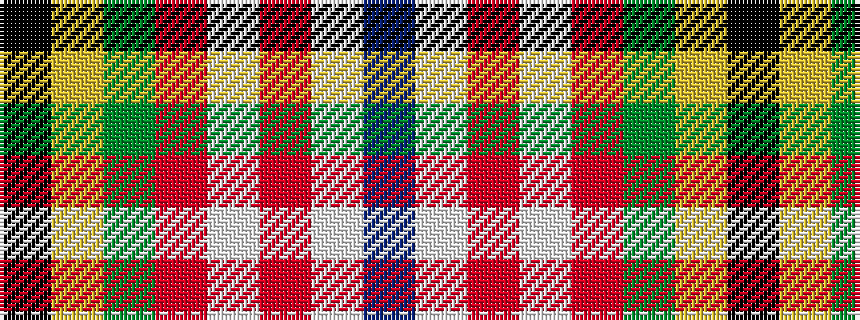

BWRWRGYK

It is a 8 stripe tartan.

<figure class="pat-woven">

<figcaption>idealised sample</figcaption>
</figure>

## Colour Sequence



## Tartans with this colour sequence

| Tartans |
|---------------|
| [Wilson's, No 83](/variants/s8/k14ly3g18r15w2r3w2p14~x2/)|
||
