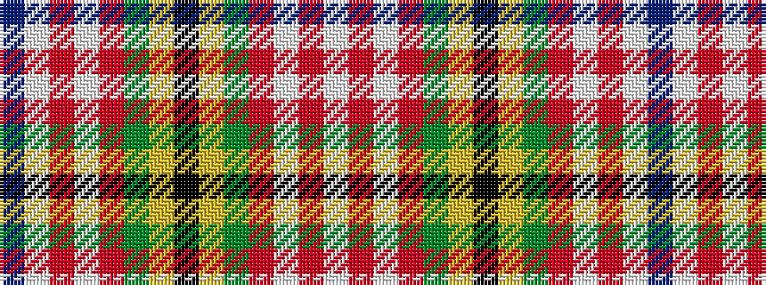

BWRWRGYKYGRWRW

It is a 14 stripe tartan.

<figure class="pat-woven">

<figcaption>idealised sample</figcaption>
</figure>

## Colour Sequence



## Tartans with this colour sequence

| Tartans |
|---------------|
| [Wilson's No.083](/setts/s14/k14ly3g18r15w2r3w2dp14~x2/)|
||
