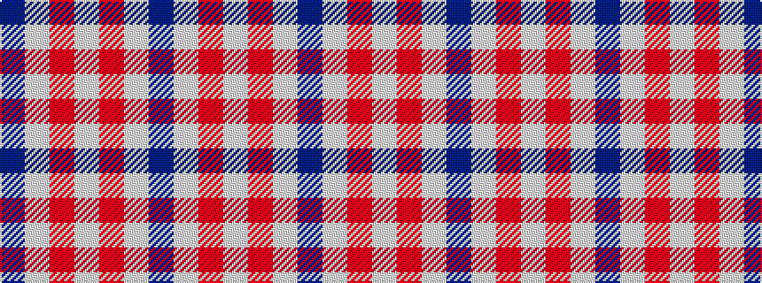

BWRWRWB

It is a 7 stripe tartan.

<figure class="pat-woven">

<figcaption>idealised sample</figcaption>
</figure>

## Colour Sequence



## Tartans with this colour sequence

| Tartans |
|---------------|
| [BC Corps of Commissionaires](/variants/s7/db12w1r3w1r3w1db6~x4/)|
||
| [BC Corps of Commissionaires, The](/variants/s7/db12lb1r3lb1r3lb1db6~x4/)|
||
