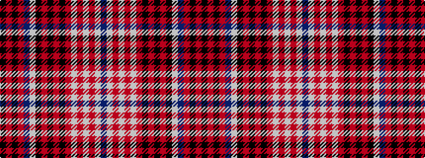

BWRWRWRKRKRKWBRKRK

It is a 18 stripe tartan.

<figure class="pat-woven">

<figcaption>idealised sample</figcaption>
</figure>

## Colour Sequence



## Tartans with this colour sequence

| Tartans |
|---------------|
| [Beaufort](/variants/s18/k3o1k2o2b24w2k8o2k2o2k2o8w2o2w2o2w8b3~x2/)|
||
