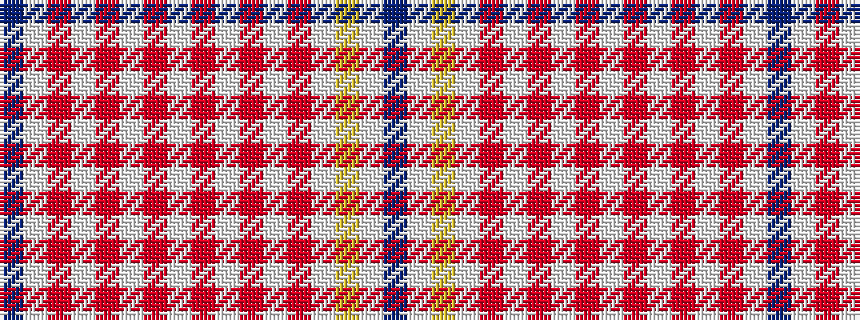

BWRWRWRWRWRWRWYWB

It is a 17 stripe tartan.

<figure class="pat-woven">

<figcaption>idealised sample</figcaption>
</figure>

## Colour Sequence



## Tartans with this colour sequence

| Tartans |
|---------------|
| [Purple Thistle](/setts/s17/dp3w15r12lp1r1lp1r1lp1r1lp1r1lp1r1lp3lr3lp15dp3~x2/)|
||
