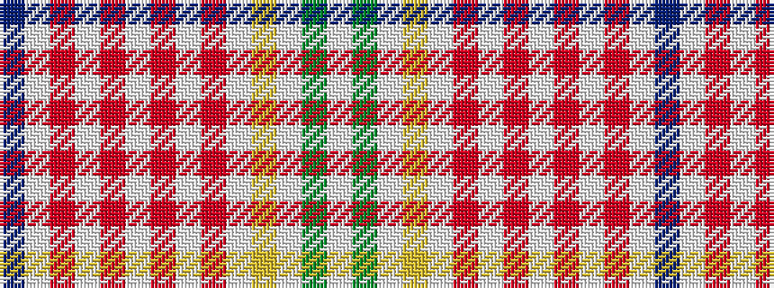

BWRWRWRWRWYWGW

It is a 14 stripe tartan.

<figure class="pat-woven">

<figcaption>idealised sample</figcaption>
</figure>

## Colour Sequence



## Tartans with this colour sequence

| Tartans |
|---------------|
| [Rainbow](/setts/s14/db1w1r1w1r1w1r1w1r1w1ly1w1g1w1~x6/)|
||
