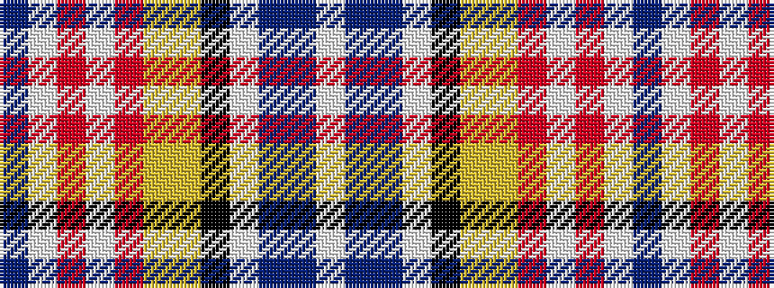

BWRWRYYKWBBW

It is a 12 stripe tartan.

<figure class="pat-woven">

<figcaption>idealised sample</figcaption>
</figure>

## Colour Sequence



## Tartans with this colour sequence

| Tartans |
|---------------|
| [Antarctic](/variants/s12/t2w76o4w4o11lo11ly7k11w4t11db32w2/)|
||
