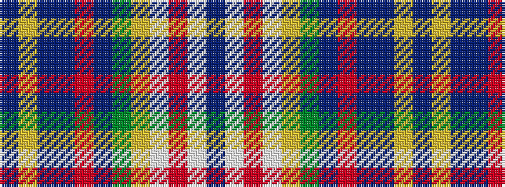

BWRWYGBRBBYB

It is a 12 stripe tartan.

<figure class="pat-woven">

<figcaption>idealised sample</figcaption>
</figure>

## Colour Sequence



## Tartans with this colour sequence

| Tartans |
|---------------|
| [Lashbrooke of Barrowfield](/variants/s12/db3w3r3w24ly4dy6db3r2db16b12ly2db3~x2/)|
||
