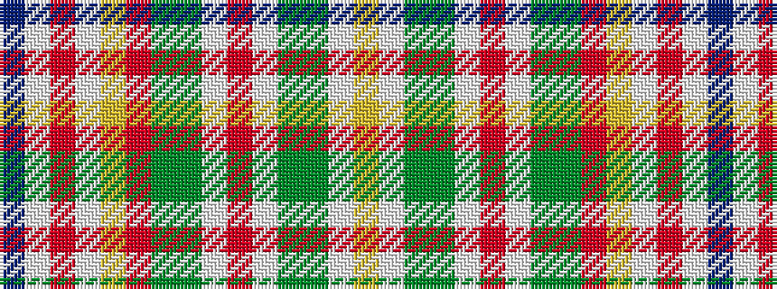

BWRWYRGGWRWGGWY

It is a 15 stripe tartan.

<figure class="pat-woven">

<figcaption>idealised sample</figcaption>
</figure>

## Colour Sequence



## Tartans with this colour sequence

| Tartans |
|---------------|
| [Contreceour dress](/setts/s15/ly10w1g2y2w2r1w2y2g2o1ly10w7r3w13db5~x2/)|
||
