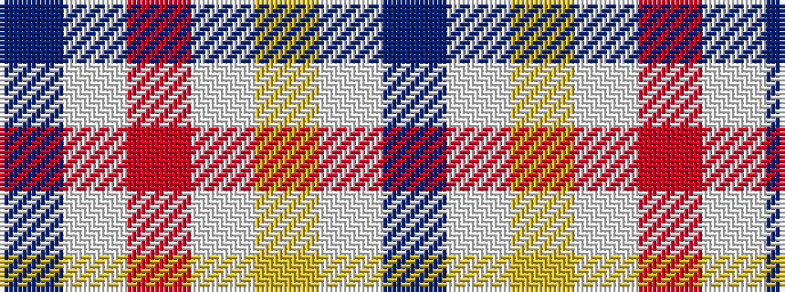

BWRWYWB

It is a 7 stripe tartan.

<figure class="pat-woven">

<figcaption>idealised sample</figcaption>
</figure>

## Colour Sequence



## Tartans with this colour sequence

| Tartans |
|---------------|
| [Justus dress](/setts/s7/db1w4r1w1ly1w4db1~x12/)|
||
