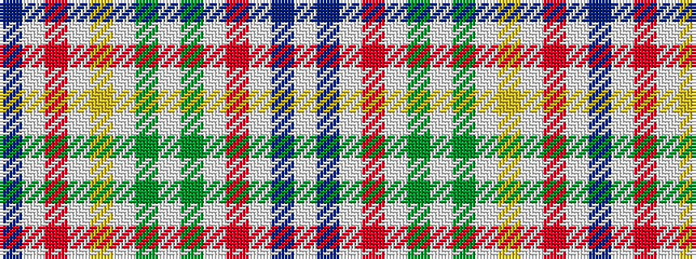

BWRWYWGWGWRWBW

It is a 14 stripe tartan.

<figure class="pat-woven">

<figcaption>idealised sample</figcaption>
</figure>

## Colour Sequence



## Tartans with this colour sequence

| Tartans |
|---------------|
| [Confederate Memorial Dress](/variants/s14/t18w4r6w4lo4w36y4w4y4w36r12w1db4w3~x2/)|
||
