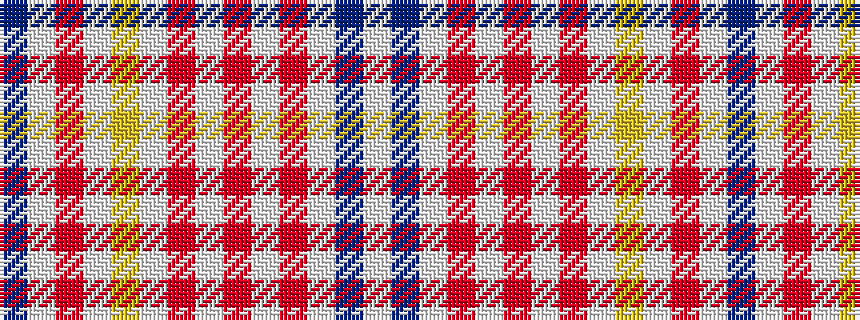

BWRWYWRWRWRWBW

It is a 14 stripe tartan.

<figure class="pat-woven">

<figcaption>idealised sample</figcaption>
</figure>

## Colour Sequence



## Tartans with this colour sequence

| Tartans |
|---------------|
| [Confederate Rose](/variants/s14/dp24w4m10w4ly4w28o6w4o6w28m18w1db4w3~x2/)|
||
