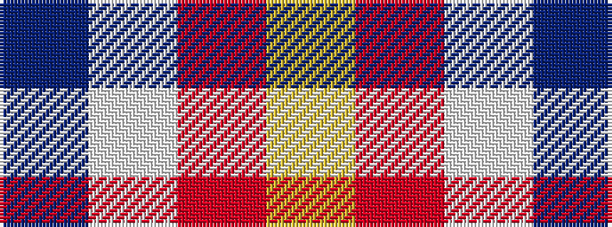

BWRY

It is a 4 stripe tartan.

<figure class="pat-woven">

<figcaption>idealised sample</figcaption>
</figure>

## Colour Sequence



## Tartans with this colour sequence

| Tartans |
|---------------|
| [Dutch Football (Corporate)](/setts/s4/lo24r1w1dt1~x11/)|
||
