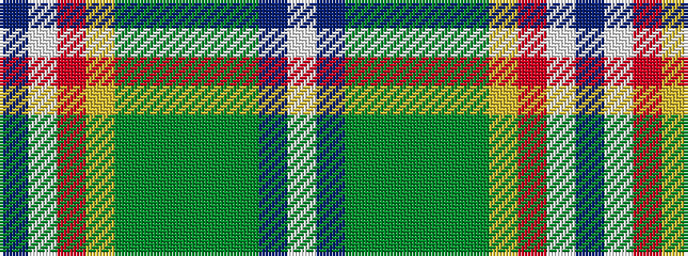

BWRYGGGGGBW

It is a 11 stripe tartan.

<figure class="pat-woven">

<figcaption>idealised sample</figcaption>
</figure>

## Colour Sequence



## Tartans with this colour sequence

| Tartans |
|---------------|
| [Nova Scotia Dress](/variants/s11/db2w20r1ly2dg8g4dg2g2dg2db20w2~x2/)|
||
| [Nova Scotia Dress (District)](/variants/s11/b2w20r1ly2dg8g4dg2g2dg2b20w2~x2/)|
||
