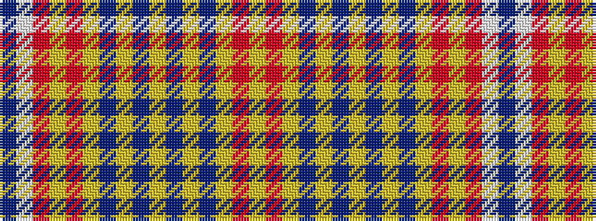

BWRYRYBYBYBYBYRY

It is a 16 stripe tartan.

<figure class="pat-woven">

<figcaption>idealised sample</figcaption>
</figure>

## Colour Sequence



## Tartans with this colour sequence

| Tartans |
|---------------|
| [Wallenberg, Nicolas Dress (Personal)](/setts/s16/lr28r1lr4dp12lr2db4ly2db4lr2dp12lr4r1lr48r3w3db3~x2/)|
||
