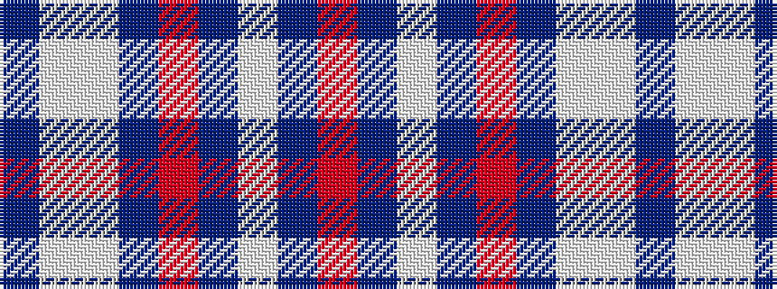

BWWBRBWBR

It is a 9 stripe tartan.

<figure class="pat-woven">

<figcaption>idealised sample</figcaption>
</figure>

## Colour Sequence



## Tartans with this colour sequence

| Tartans |
|---------------|
| [Greater St. Louis Firefighters (Cor)](/variants/s9/n3w3w38n25r3n6w7n3r2~x2/)|
||
