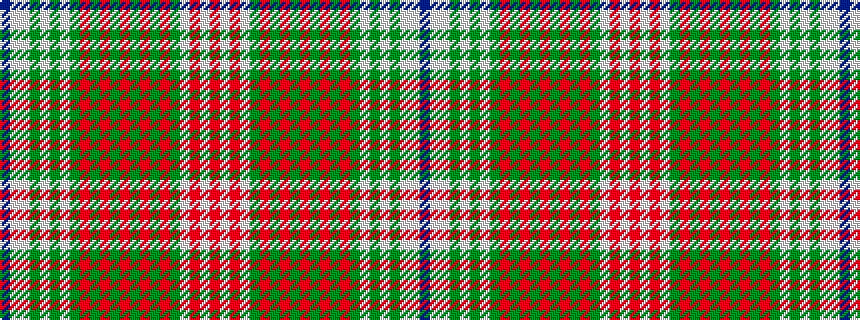

BWWGWGWGRGRGRGRGRGWRWR

It is a 22 stripe tartan.

<figure class="pat-woven">

<figcaption>idealised sample</figcaption>
</figure>

## Colour Sequence



## Tartans with this colour sequence

This pattern is a design lineage: every tartan below shares one colour order, whatever its owner —
near-identical designs are grouped, the largest lineage first (#112: the pattern is a tartan's
second parent, beside its family or clan).

<table class="sett-table">
<tbody>
<tr><td><a href="/variants/s22/db30w2lb3g3lb3g3lb3g16r3g3r3g3r3g3r3g25r15g4lb4r8w2r15~x2/">Wilson (Janet) #2</a></td></tr>
<tr><td class="sett-swatch"></td></tr>
<tr class="cluster-sep"><td></td></tr>
<tr><td><a href="/variants/s22/dp30w2lb3dg3lb3dg3lb3dg16r3dg3r3dg3r3dg3r3dg25r15dg4lb4r8w2r15~x2/">Wilson, Janet (1780 Original)</a></td></tr>
<tr><td class="sett-swatch"></td></tr>
</tbody>
</table>

