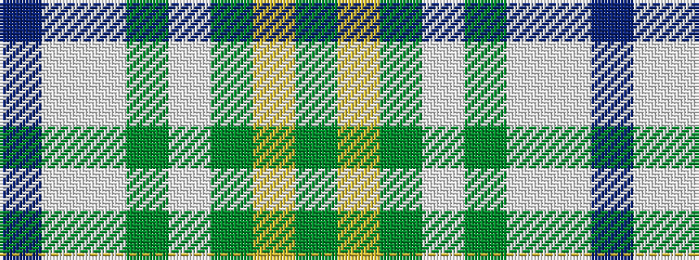

BWWGWGYG

It is a 8 stripe tartan.

<figure class="pat-woven">

<figcaption>idealised sample</figcaption>
</figure>

## Colour Sequence



## Tartans with this colour sequence

| Tartans |
|---------------|
| [Iroquois Falls Centenary](/setts/s8/g18lg6dy3w1dy3w1lt6db6~x2/)|
||
