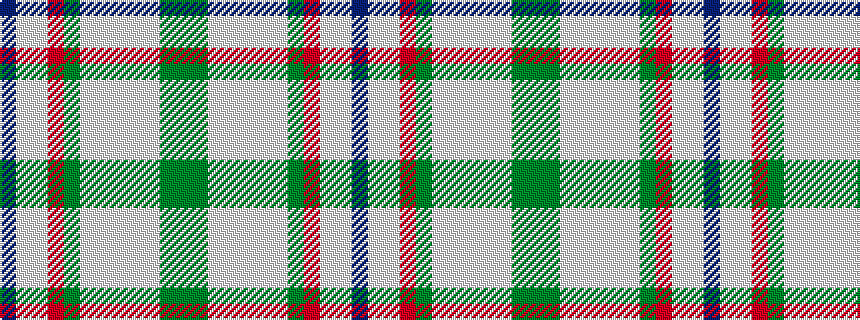

BWWRGWWWWWGG

It is a 12 stripe tartan.

<figure class="pat-woven">

<figcaption>idealised sample</figcaption>
</figure>

## Colour Sequence



## Tartans with this colour sequence

This pattern is a design lineage: every tartan below shares one colour order, whatever its owner —
near-identical designs are grouped, the largest lineage first (#112: the pattern is a tartan's
second parent, beside its family or clan).

<table class="sett-table">
<tbody>
<tr><td><a href="/setts/y2g16lb2w2lb2w2lb6g7r2w1lb1dp1/">Fredericton</a></td></tr>
<tr><td class="sett-swatch"></td></tr>
<tr><td><a href="/variants/s12/dp3lb1w9r6g5lb2w2lb2w2lb2g12y2~x2/">Fredericton</a></td></tr>
<tr><td class="sett-swatch"></td></tr>
<tr><td><a href="/variants/s12/dp3lb1w9r6dg5lb2w2lb2w2lb2dg12y2~x4/">Fredericton #1</a></td></tr>
<tr><td class="sett-swatch"></td></tr>
<tr><td><a href="/variants/s12/dp6lb2w24r15g12lb4w4lb4w4lb4g34y4/">Fredericton (District)</a></td></tr>
<tr><td class="sett-swatch"></td></tr>
</tbody>
</table>

