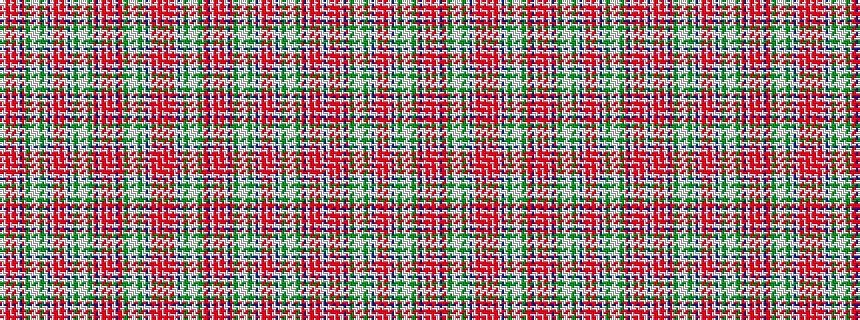

BWWRRWRRWWBRWGGWWWWWGGWWBWWRRWRRWWBWWGGWWWWWGGWRBWWRRWRRWWBRRWGGWWWWWGGWWBWWRRWRRW

It is a 82 stripe tartan.

<figure class="pat-woven">

<figcaption>idealised sample</figcaption>
</figure>

## Colour Sequence



## Tartans with this colour sequence

This pattern is a design lineage: every tartan below shares one colour order, whatever its owner —
near-identical designs are grouped, the largest lineage first (#112: the pattern is a tartan's
second parent, beside its family or clan).

<table class="sett-table">
<tbody>
<tr><td><a href="/variants/s82/db10lb3w1ri6r12w1r12ri6w1lb3db10r6w1dg10y6w1lb2w1lb2w1y6dg10w1lb3db10lb3w1ri5r6w1r6ri5w1lb3db10lb3w1dg10y6w1lb2w1lb2w1y6dg10w1r6db10lb3w1ri6r12w1r12ri6w1lb3db10r6ri5w1dg10y6w1lb2w1lb2w1y6dg10w1lb3db10-h375b155ff366c7e7/">Unnamed C18th - Cant Counts</a></td></tr>
<tr><td class="sett-swatch"></td></tr>
</tbody>
</table>

